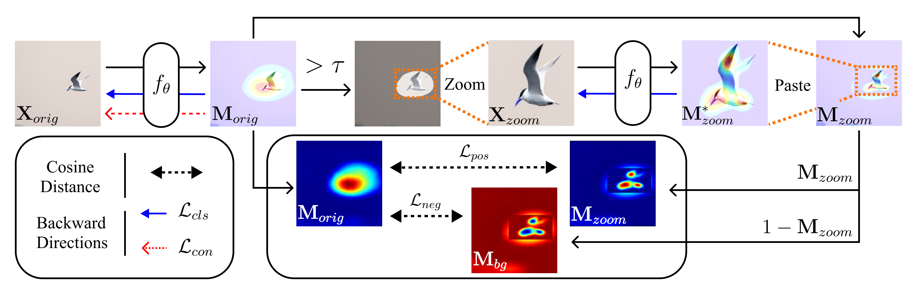

## Small Object Matters in Weakly Supervised Object Localization



> **Abstract:** *Weakly-supervised object localization (WSOL) methods aim to capture the extent of the target object without full supervision such as bounding boxes or segmentation masks. Although numerous studies have been conducted in the research field of WSOL, we find that most existing methods are less effective at localizing small objects. In this paper, we first analyze why previous studies have overlooked this problem. Based on the analysis, we propose two remedies: 1) new evaluation metrics and a dataset to accurately measure localization performance for small objects, and 2) a novel consistency learning framework to zoom in on small objects so the model can perceive them more clearly. Our extensive experimental results demonstrate that the proposed method significantly improves small object localization on four different backbone networks and four different datasets, without sacrificing the performance of medium and large objects. In addition to these gains, our method can be easily applied to existing WSOL methods as it does not require any changes to the model architecture or data input pipeline.*

Official implementation of "Small Object Matters in Weakly Supervised Object Localization" <br>

Most part of our codes originates from this [repository](https://github.com/clovaai/wsolevaluation).

## Dependencies
Run the following command to build the docker container. <br>
Modify `pytorch/pytorch:latest` tag in `Dockerfile`, if necessary.
```bash
docker build . -t wsol_test
docker run -it -d --gpus '"device=0"' --shm-size=16G --name wsol_test wsol_test:latest
docker exec -it wsol_test /bin/bash
```

Environments (`pip freeze` returns):
```bash
munch==2.5.0
sklearn==0.0
opencv-python==4.5.5.64
torch==1.11.0
torchvision==0.12.0
```

## Prepare train+eval datasets
We borrowed the script for preparing datasets from the original [repository](https://github.com/clovaai/wsolevaluation). <br>

**ImageNet**<br>
To prepare ImageNet data, download ImageNet "train" and "val" split from [here](http://www.image-net.org/) and put the downloaded file on dataset/ILSVRC2012_img_train.tar and dataset/ILSVRC2012_img_val.tar.

Then, run the following command on the `root` directory to extract the images.

```bash
sh dataset/prepare_imagenet.sh
```

**CUB**<br>
Run the following command to download the original CUB dataset and extract the image files on the `root` directory.

```bash
sh dataset/prepare_cub.sh
```

Note: you can also download the CUBV2 dataset from [here](https://drive.google.com/open?id=1U6cwKHS65wayT9FFvoLIA8cn1k0Ot2M1). Put the downloaded file on the `dataset/CUBV2.tar` directory and then run the above script.

**OpenImages**<br>
To download and extract files, run the following command on `root` directory
```bash
sh dataset/prepare_openimages.sh
```

Note: you can also download the OpenImages30k dataset from here 
([images](https://drive.google.com/open?id=1oOb4WQ-lb8SYppHEg3lWnpHk1X8WVO4e)
, [masks](https://drive.google.com/open?id=1eu1YvcZlsEalhXTS_5Ni5tkImCliIPie)).
Put the downloaded `OpenImages_images.zip` and `OpenImages_annotations.zip` 
files in `dataset` directory and run the above script.

## Training
Run the following command when training the ResNet50 network on the ImageNet dataset.
```bash
sh scripts/resnet_imagenet_ours.sh
```

For the sake of reproducing our experimental results, we include all training scripts for the three backbones and three datasets in `./scripts/`. <br>
- You must modify `--data_root, --mask_root` arguments by your own local path. <br>

Training log and checkpoints will be saved in `./train_log/`.

### Fine-Tuning
In our paper, we applied our method to three state-of-the-art methods: 

[Domain Adaptation](https://github.com/zh460045050/DA-WSOL_CVPR2022) (DA), 
[Bridging the Gap](https://github.com/ejkim47/bridging-gap-wsol) (Brid) and 
[IVR](https://github.com/GenDisc/IVR).

For reproducing the results, first you need to download the pretrained models 
[here](https://drive.google.com/drive/folders/12KaM44XHjRZ_cRnYzl5wKdZn2cqymH6P?usp=sharing).

Then, run the following command:
- [Domain Adaptation](https://github.com/zh460045050/DA-WSOL_CVPR2022) (ResNet50, ImageNet):
```bash
sh scripts/resnet_imagenet_ours_with_da.sh
```

- [Bridging the Gap](https://github.com/ejkim47/bridging-gap-wsol) (ResNet50, ImageNet):
```bash
sh scripts/resnet_imagenet_ours_with_brid.sh
```

- [IVR](https://github.com/GenDisc/IVR) (ResNet50, ImageNet):
```bash
sh scripts/resnet_imagenet_ours_with_ivr.sh
```
`percentile` values in each datasets and architectures are report in following table.

<table style="text-align:center">
    <thead>
        <tr>
            <th>ImageNet</th>
            <th>ResNet50</th>   
            <th>VGG16</th> 
            <th>Inception V3</th> 
        </tr>
    </thead>
    <tbody>
        <tr>
            <td>percentile</td>
            <td>0.3</td><td>0.2</td><td>0.4</td>
        </tr>
    </tbody>
</table>


## Evaluation
Add the following arguments in the script.
```bash
--checkpoint_path train_log/resnet_imagenet_ours/last_checkpoint.pth.tar \
--eval_on_val_and_test False \
--eval_size_ratio True
```
### Information of the Hyperparameters

<table>
  <thead>
    <tr>
      <th rowspan="2">Architecture</th>
      <th colspan="5">ImageNet</th>
      <th colspan="5">CUB</th>
      <th colspan="5">OpenImages</th>
    </tr>
    <tr>
      <th>λ₁</th>
      <th>λ₂</th>
      <th>λ₃</th>
      <th>τ</th>
      <th>ν</th>
      <th>λ₁</th>
      <th>λ₂</th>
      <th>λ₃</th>
      <th>τ</th>
      <th>ν</th>
      <th>λ₁</th>
      <th>λ₂</th>
      <th>λ₃</th>
      <th>τ</th>
      <th>ν</th>
    </tr>
  </thead>
  <tbody>
    <tr>
      <td>ResNet50</td>
      <td>0.90</td>
      <td>0.10</td>
      <td>0.90</td>
      <td>0.15</td>
      <td>0.30</td>
      <td>0.50</td>
      <td>0.20</td>
      <td>0.80</td>
      <td>0.20</td>
      <td>0.80</td>
      <td>1.50</td>
      <td>0.50</td>
      <td>0.50</td>
      <td>0.30</td>
      <td>1.00</td>
    </tr>
    <tr>
      <td>VGG16</td>
      <td>0.80</td>
      <td>0.50</td>
      <td>0.80</td>
      <td>0.50</td>
      <td>0.90</td>
      <td>0.90</td>
      <td>0.10</td>
      <td>0.70</td>
      <td>0.70</td>
      <td>0.20</td>
      <td>1.00</td>
      <td>0.70</td>
      <td>0.70</td>
      <td>0.05</td>
      <td>0.10</td>
    </tr>
    <tr>
      <td>Inception</td>
      <td>0.60</td>
      <td>0.70</td>
      <td>0.70</td>
      <td>0.50</td>
      <td>0.60</td>
      <td>1.00</td>
      <td>0.20</td>
      <td>0.80</td>
      <td>0.40</td>
      <td>0.10</td>
      <td>0.20</td>
      <td>1.30</td>
      <td>0.90</td>
      <td>0.15</td>
      <td>0.10</td>
    </tr>
  </tbody>
</table>


### Arguments

- `eval_on_val_and_test` : evaluation on val or test dataset.
- `eval_size_ratio` : print the scores that evaluated by `MaxBoxAcc^S, MaxBoxAcc^mean` metric. <br>

## Pretrained Model
You can download pre-trained models [here](https://drive.google.com/drive/folders/12KaM44XHjRZ_cRnYzl5wKdZn2cqymH6P?usp=sharing).
- Pretrained models trained on ImageNet, CUB, and OpenImages using three architectures (ResNet50, VGG16, InceptionV3) are available.
- File name example: `resnet_imagenet_ours.pth.tar` is trained on the ImageNet dataset using ResNet50.
- We upload all the models on Google Drive of an anonymous account.

To evaluate the pre-trained model, modify the `--checkpoint_path` argument by the path of the downloaded file.

## How to apply this method to my own code?

Our method can be easily applied to other methods: <br>
- First, copy and paste `./wsol/method/crop.py` into your code repository.
- Next, add the following snippets into your code.
```python
# main.py
self.crop_module = wsol.method.CropCAM(self.args.large_feature_map,
                                       self.args.original_feature_map,
                                       architecture=self.args.architecture,
                                       # Hyperparameters
                                       loss_ratio=self.args.loss_ratio,
                                       loss_pos=self.args.loss_pos,
                                       loss_neg=self.args.loss_neg,
                                       crop_threshold=self.args.crop_threshold,
                                       crop_ratio=self.args.crop_ratio,
                                       # For CAAM
                                       attention_cam=self.args.attention_cam,
                                       # For attach the network freely.
                                       wsol_method=self.args.wsol_method,
                                       other_method_loss_ratio=self.args.other_method_loss_ratio,
                                       crop_method_loss_ratio=self.args.crop_method_loss_ratio,
                                       # For Several Norm Method.
                                       norm_method=self.args.norm_method,
                                       percentile=self.args.percentile,
                                       crop_with_norm=self.args.crop_with_norm)
```

```python
# main.py
if epoch >= self.args.crop_start_epoch:
    output_dict = self.crop_module.forward(self.model, images, target)
    logits = output_dict["logits"]
    loss, att_loss, cls_loss = self.crop_module.get_loss(output_dict=output_dict, target=target)
    return logits, loss, att_loss, cls_loss
```

```python
# resnet.py
if crop:
    return {'cam_weights': self.fc.weight[labels],
            'logits': logits, 'feature_map': x}
```
#### Notes
- We assume that your model instance is in the variable `self.model`.
- You might need to modify the above snippets for applying them to your code repository.
- In that case, you can refer to our implementation in `main.py` and `wsol/resnet.py`.
